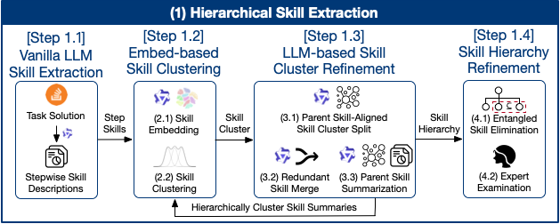

# Skill Cluster Construction

Extracts representative data science skills from Stack Overflow task solutions through skill-aligned hierarchical clustering.



## Pipeline

1. **LLM-based Skill Extraction** — Break down solutions into stepwise skill descriptions
2. **Embedding-based Skill Clustering** — Cluster semantically similar skills
3. **LLM-based Skill Cluster Refinement** — Refine clusters via LLM-based splitting
4. **Skill Hierarchy Refinement** — Recursive cluster-and-refine process

## Setup

**1. Install dependencies**
```bash
pip install -r requirements.txt
```

**2. Set API key**
```bash
echo "DASHSCOPE_API_KEY=your_key_here" > .env
```

## Usage

```bash
bash skill_cluster.sh
```

> **Recommended**: Execute step by step rather than running the whole script at once. LLM steps process thousands of entries — verify output line counts match expected (e.g., input 1000 entries should yield 1000 output entries; missing entries indicate failures needing retry).

## Output

Used by [`generator`](../generator):

- `data/stackoverflow-data-science.jsonl` — Source Stack Overflow data
- `data/steps.jsonl` — Extracted skill steps
- `data/step-clusters.jsonl` — Clustered skills
- `data/skill-descriptions.jsonl` — Detailed descriptions
- [`steps-embed.npy`](https://huggingface.co/datasets/shawnzzzh/AgenticDataBench/blob/main/steps-embed.npy) - Step embeddings (~1.1 GB)